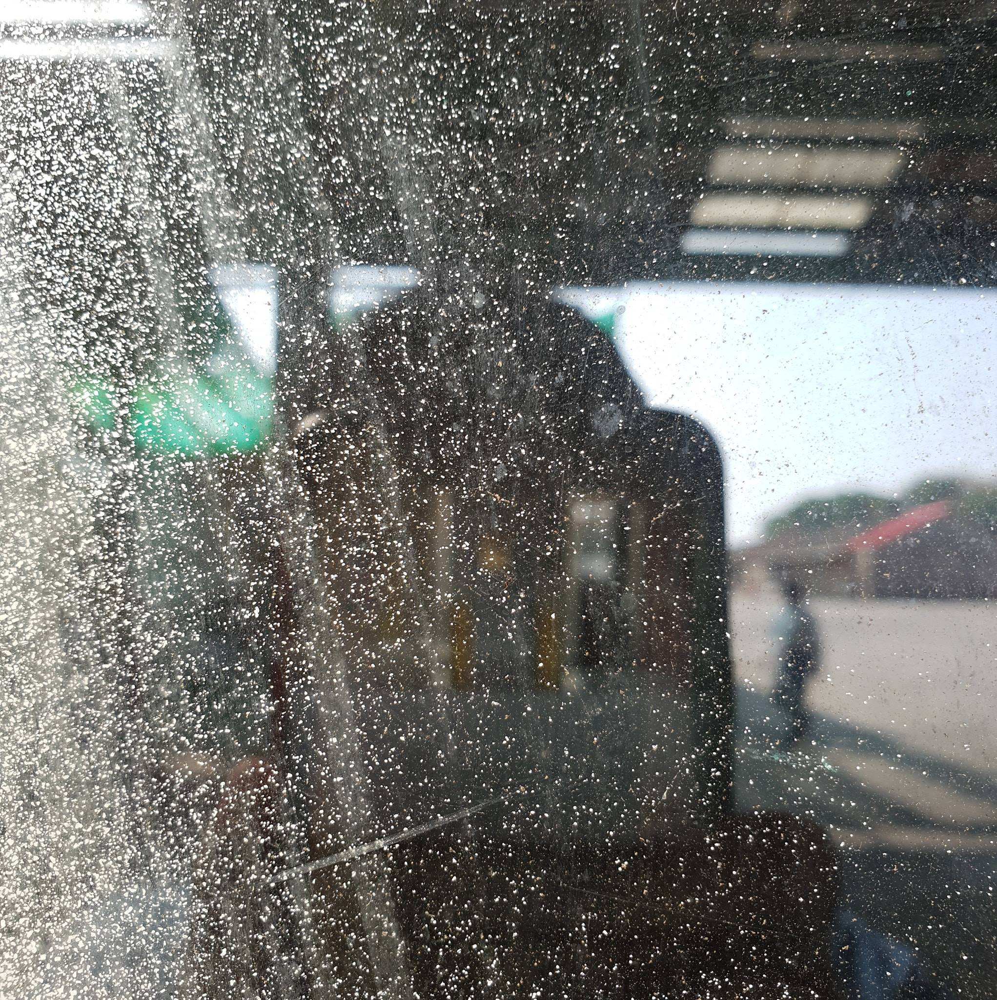

    

        

            
            
要不要放照片🤔

        

        

            <h1>阮仕輔 Shihfu Juan (XLion)</h1>
            

                XLion 只是個網名/ID，不是拿來叫的，那怎麼來的？  
                其實，因為我兒時喜歡獅子，所以當時英文名字叫 Lion，然後 <code>X</code> 泰褲辣，所以就這麼誕生了。。
            

        

    

