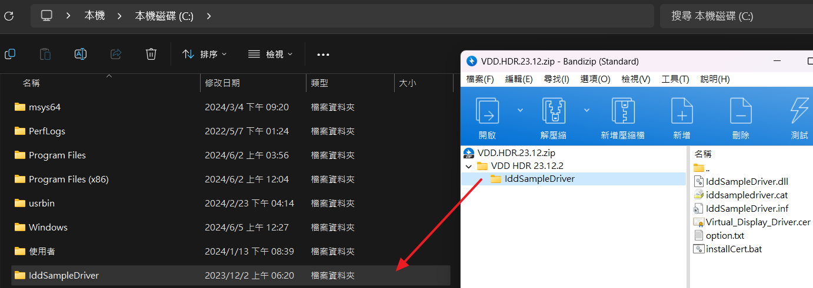

本篇直接帶你不透過 HDMI 欺騙器，在 Windows 建立虛擬螢幕，避免設備未連接螢幕時軟體無法正確渲染、解析度過低或是遠端控制軟體無法抓取畫面的問題。

## 誰需要這個?
* 一台不會接螢幕，永遠只拿來被遠端控制的電腦
* 一台闔上螢幕會「貼心地」將內建螢幕連結斷開的筆電，但你又希望能遠端控制它
* 你有一台使用 DP 連結的螢幕，螢幕睡眠會斷開

## GitHub 套件庫


依照作者描述，支援的解析度可從 `640 x 480` ~ `7680 x 4320` (8K)，刷新率可支援以下檔位:
* 60hz
* 75hz
* 90hz
* 120hz
* 144hz
* 165hz
* 240hz
* 480hz
* 500hz

並且支援 HDR

## 安裝
1. 首先去它的 [Releases](https://github.com/itsmikethetech/Virtual-Display-Driver/releases) 頁面，尋找 **Latest**，下載**不是 Source code** 的 `zip`

2. 接著把 `IddSampleDriver` 直接解壓縮至 C 槽的根目錄，如圖所示


3. 進入 `C:\IddSampleDriver` 資料夾，右鍵 `installCert.bat` 檔案，選擇**使用系統管理員身分執行**，這是為了安裝開發者自行簽名的驅動證書，執行結果類似如下


安裝第三方自簽證書本質上存在一定風險，倘若您的設備並非本人持有，或受組織列管，安裝前請先洽詢管理員，有其他疑慮者，也請勿安裝


```
root "受信任的根憑證授權單位"
簽章符合公開金鑰
憑證 "Virtual Display Driver" 已新增到存放區中。
CertUtil: -addstore 命令成功完成。
TrustedPublisher "受信任的發行者"
簽章符合公開金鑰
憑證 "Virtual Display Driver" 已新增到存放區中。
CertUtil: -addstore 命令成功完成。
請按任意鍵繼續 . . .
```
接著關閉此視窗

4. 進入**裝置管理員**

打開檔案總管 -> 右鍵 **本機** -> 點選 **顯示其他選項**(僅 Windows 11) -> 點選 **管理** -> 點選 **裝置管理員**

5. 安裝驅動

點一下該視窗的中心空白處 -> 點選 **動作** -> 點選 **新增傳統硬體** -> 點擊 **下一步** -> 選取 **安裝我從清單中手動選取的硬體 (進階選項)**

-> 點擊 **下一步** -> 選取 **顯示卡** -> 點擊 **下一步** -> 點擊 **從磁片安裝** -> 點擊 **瀏覽** -> 來到 `C:\IddSampleDriver` -> 點擊唯一的 `inf` 檔案 -> 點擊 **開啟** -> 點擊 **確定** -> 點擊 **下一步** -> 點擊 **下一步** -> 點擊 **完成** 來關閉視窗

6. 設定虛擬螢幕的解析度

桌面空白處右鍵 -> 點擊 **顯示設定**

接著你就會看到類似這樣的螢幕排列


其中，那個迷你的螢幕就是那個虛擬螢幕，我們需要把它設定為正常的解析度，我們要調兩個東西，首先，先點擊那個迷你螢幕，在此是 2 號，接著往下滑

當修改虛擬螢幕的設定時，請忽略所有的「(建議選項)」


修改**解析度**，這裡我推薦這三種，皆是 `16:9` ，或是你自己有需求，自行選擇
* 1920 x 1080 (Full HD) <- 大部分時候請選這個
* 2560 x 1440 (2K)
* 3840 x 2160 (4K)

修改**比例**，如果是 Full HD，那麼可以不調，但考慮到大部分的時候，大家都用筆電遠端連線，為了眼睛健康，推薦改成 **125%**，如果是 2K (含) 以上，那基本上非常建議調整了，否則眼睛會脫窗。

<br><p class="c-text">如果本工具對你有幫助，記得給原作者一個 Star !</p>