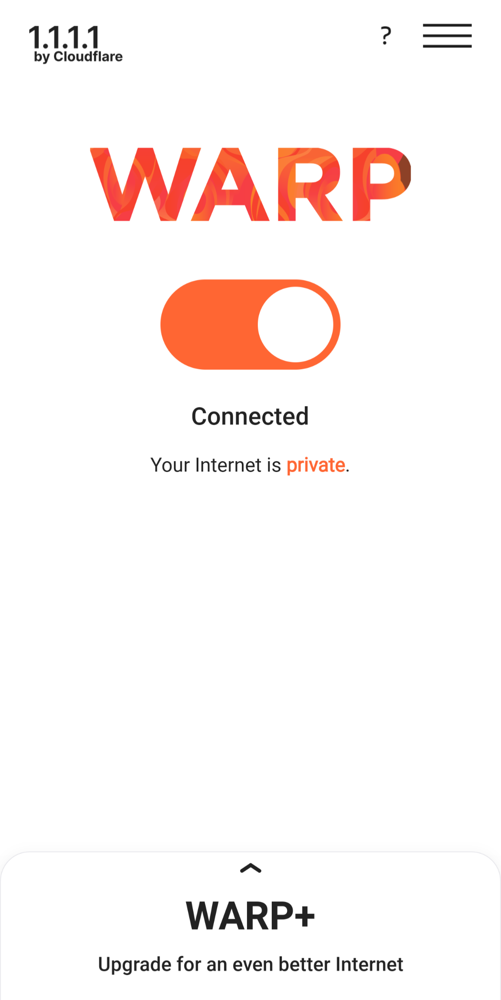
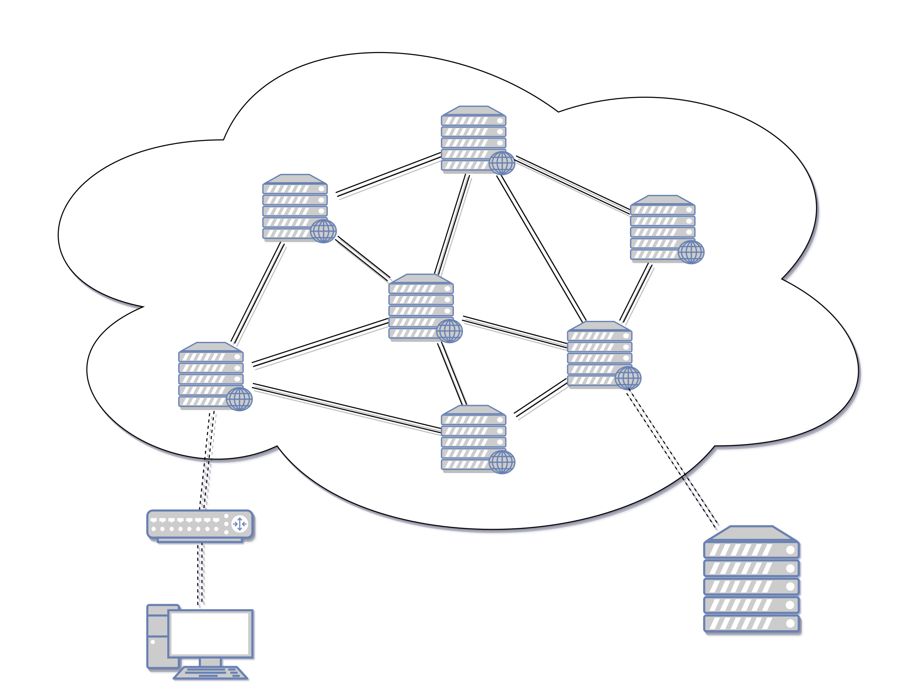
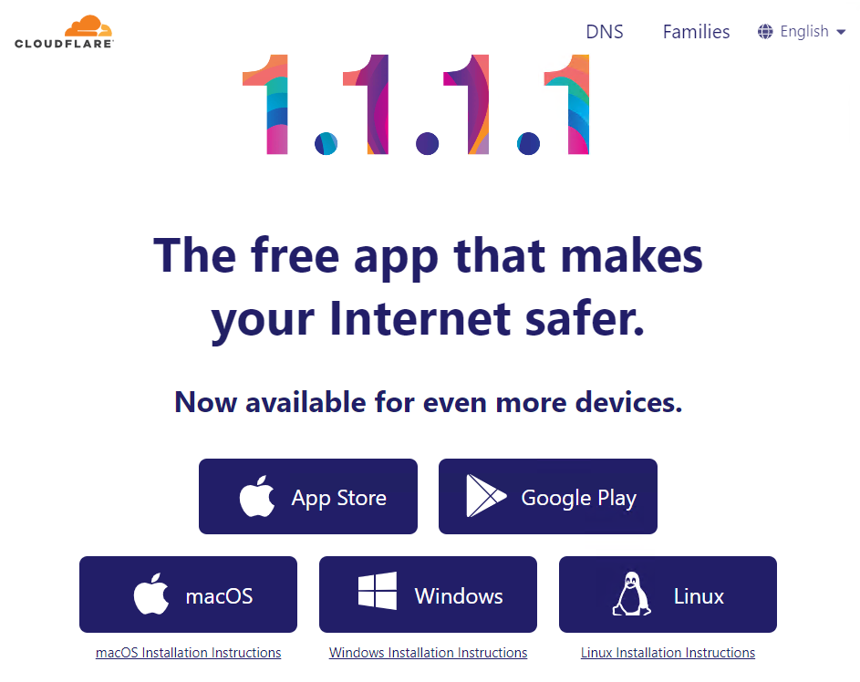

<div class="container">
    <div class="row align-mid">
        <div class="col"></div>
        <div class="col"></div>
    </div>
    <div class="row">
        <div class="col c-text"><figcaption>Windows/macOS</figcaption></div>
        <div class="col c-text"><figcaption>Android/iOS</figcaption></div>
    </div>
</div>

你有沒有遇過明明 [SpeedTest](https://www.speedtest.net/) 速度很快，Ping，也沒有很高，但開某些網站就是莫名的卡，下載檔案速度就剩幾 `kb/s` 的速度，或是遊戲爆 Ping 爆的很慘等奇怪經驗嗎？

除了對方伺服器超載或故障，很可能的原因是你與目的地伺服器之間的「路由」（注意！　不是路由器），出現了問題，然後基本上，你對這件事情是無能為力的，就算跟電信業者抱怨也是無濟於事的。

## 什麼是路由


<figcaption><a href="https://commons.wikimedia.org/wiki/File:Internet-transit-2.svg">Source: Wikimedia Commons, Tomybrz, CC BY-SA 4.0</a></figcaption>

網路的組成如圖所示，是由成千上萬的路由器互連而成，並且它們之間會與不只一個路由器連線，這就意味著當你要連至遠端伺服器時，會有非常多種路徑可以選擇，想當然，肯定會有爛路的，這就會導致連線效能低下，延遲高的問題，但這些都是世界各地電信業著們的事情，一般終端使用者們沒辦法改變什麼。

> 那為何 [SpeedTest](https://www.speedtest.net/) 等測速軟體速度很快？

因為 [SpeedTest](https://www.speedtest.net/) 會自動挑選距離你物理距離近的測速伺服器，越近的伺服器，速度會越快，延遲會越低。


**注意**，如果你連 [SpeedTest](https://www.speedtest.net/) 的測速結果都很糟糕，那麼可以先試試其他測速服務，例如 [Cloudflare Speed Test](https://speed.cloudflare.com/)，如果還是沒用，請先解決這個問題，因為你連通往外部的網路都不順了，外部連至更外部順暢了也沒有你的事。


## 什麼是 Cloudflare WARP

也可見[官網介紹](https://blog.cloudflare.com/zh-cn/1111-warp-better-vpn-zh-cn/)，這裡只簡述。

")

Cloudflare WARP 是由全球知名 CDN 公司 Cloudflare 所出品的「類 VPN」的服務，CDN 公司簡單來說就是該公司全世界各地皆有部署**資料中心**，這些資料中心還會快取資料，讓使用者可以以比較快速的方式取得伺服器的資料，接著它們之間在絕大多數的時候都會使用高速專線**互聯**，這會讓各個使用者能以更有效率的方式取得資料。(見上圖)

有稍微關注 Cloudflare 或 CDN 的都知道，Cloudflare 提供了免費的 CDN 服務，並透過進階功能藉此營利，也因此它們以蠻快的速度壯大了公司。

WARP 的運作原理正是利用了它們全世界架設的 CDN 節點，讓使用者連至國外遭遇糟糕的路由時可利用 WARP 增進連線的穩定性，它們也有提供 WARP+ 的付費服務，號稱可以再增進速度，這在以前的確是如此，但在現今，實際上我認為這其實就是「斗內」作用而已，為何呢？ 因為我其實在現在常常在透過學術網路 (TANet) 測試發現 WARP 常常都可以測到幾100 Mbps 的速度，根本跟前述的免費 CDN 服務一樣，佛新公司！

## 什麼時候該用呢
- **用臺灣學術網路(TANet)時**，因為學術網路在底層上連至海外時，都會繞路，這導致連 GitHub 都會卡的尷尬局面
- **明明網路速度快**，但就是慢
- **遊戲更新時**，提供遊戲更新的伺服器不同於實際遊玩時的伺服器，有時遇到大更新會有塞車的情形
- **使用公共 WiFi 時**，儘管因資安考量不推薦使用公共 WiFi，但還是會有逼不得已的時候，開啟 WARP 可避免流量側錄，尤其是 DNS 流量

但這也不是萬靈丹，也可能會有負優化的效果，倘若發生這樣的情況，那就關掉吧。

## Let's Go!

**警告！** 如果你使用公司持有的設備，或是在公司的電腦，又或者是有使用受公司或組織監管的設備，請勿使用，因為使用此類軟體在一定程度上就是在規避監管。


首先去官網，網址很好記:

大部分的網路直接在網址列輸入 `1.1.1.1` 即可

但如果你的網路環境會封鎖 `1.1.1.1` 這個 IP，那麼請用網址

<https://one.one.one.one> (如果是用手打的，可能必須輸入https)



Cloudflare WARP 可以說全平台都支援，對於 Android, iOS，直接下載安裝打開並且點擊中間開關連線即可，系統會確認是否添加 VPN 設定，允許即可


Windows 與 macOS皆是下載後直接執行安裝程式，一直下一步即可，沒有偷藏廣告軟體，童叟無欺

macOS 可用 [Homebrew](https://brew.sh/zh-tw/) 安裝:
```
brew install --cask cloudflare-warp
```

對於 Windows, macOS 安裝完後，去狀態列找圖標，點開來都會有這樣的介面，直接把開關點開即可。


對於 Linux，直接點進去就會有參考指令，根據你的發行版照做即可，至於 Arch Linux 有 [AUR](https://aur.archlinux.org/packages/cloudflare-warp-bin) 可用，但是 Linux 的 WARP 沒 GUI 介面，只能靠指令行開啟跟關閉。

1. 首先，你必須先註冊：
```
warp-cli registration new
```
同意使用條款即可

2. 接著連線
```
warp-cli connect
```
3. 如果要斷線
```
warp-cli disconnect
```
4. 如果要查看連線狀態
```
warp-cli status
```
倘若出現如下代表連線成功
```
Success
Status update: Connected
```


## 是否違反遊戲 ToS

以最近很紅又非常常出問題的特戰英豪為例，官方明定使用 VPN 是違反 ToS 的，但原因其實很明顯，主要有兩個
1. 規避區域偵測
尤其是為了跨服課金的，這 Riot Games 是一定會抓的，但 Cloudflare WARP 本身出口 IP 依然會是台灣 IP，除非你的所在國家沒有資料中心 (見 [Cloudflare System Status](https://www.cloudflarestatus.com/))，以台灣來說，有台北及高雄兩個資料中心，那麼在這點就是不成立的。

2. 利用 VPN 匿蹤來「搗亂」
這不是不可能，但 Cloudflare 畢竟也是大公司，它們自己也會有一定程度的風控，所以濫用的情況會比其他 VPN 業者還不嚴重

但這畢竟還是規定的灰色地帶，所以對於任何競技遊戲的使用請自行斟酌，沒有人會因此負任何責任。

那如果是非競技遊戲的，對於這樣的規定就是比較鬆或是沒有了，以 Hoyoverse 的遊戲為例，官方甚至可以說是*不太在意*這件事的。
