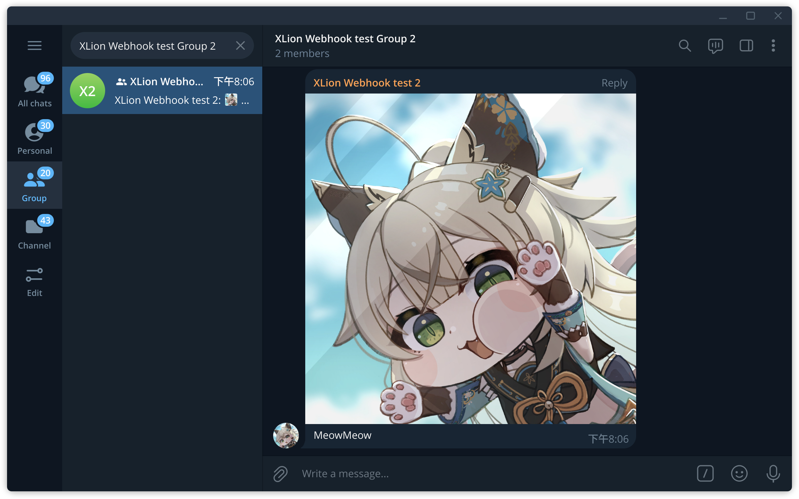

因為 LINE Notify 要沒了。


這不太算保母級教學，這裡假設你已會使用 LINE Notify，在考慮換成 Telegram 的，極其簡易的用例。



<figcaption>Source: <a href="https://www.pixiv.net/artworks/113256424" target="_blank">Pixiv Artwork ID: 113256424</a></figcaption>

## 涵蓋

事先預告，這裡只涵蓋：
* Python
  * 文字
  * 圖片
* Curl 
  * 文字

## 建立機器人

1. 在 Telegram 內搜尋 `@BotFather` ，加它好友，它是官方建立機器人的機器人
```text
@BotFather
```
2. 傳送 `/start` 訊息給它，或 UI 可能有 start 按鈕讓你按
3. 點選 Menu 或選單，選擇 **/newbot create a new bot**
4. 然後它就會問你機器人要取什麼名字，在此為 `XLion Webhook test 2`
5. 接者是使用者名稱，這裡規定必須以 "bot" 結尾，在此為 `xlion_webhook2_bot`
6. 然後最後它就會給你 API Token

對話內容看起來像這樣：

<blockquote>
<p class="r-text">/newbot</p><hr>

Alright, a new bot. How are we going to call it? Please choose a name for your bot. <hr>

<p class="r-text">XLion Webhook test 2</p><hr>

Good. Now let's choose a username for your bot. It must end in \`bot\`. Like this, for example: TetrisBot or tetris_bot.<hr>

<p class="r-text">xlion_webhook2_bot</p><hr>

Done! Congratulations on your new bot. You will find it at t.me/xlion_webhook2_bot. You can now add a description, about section and profile picture for your bot, see /help for a list of commands. By the way, when you've finished creating your cool bot, ping our Bot Support if you want a better username for it. Just make sure the bot is fully operational before you do this.

Use this token to access the HTTP API:
8158068843:AAEoTMNzo5dWuHBvE3UGzBpOWAgf7gMQSJE
Keep your token secure and store it safely, it can be used by anyone to control your bot.

For a description of the Bot API, see this page: https://core.telegram.org/bots/api

</blockquote>

日後使用此機器人時，API 請求格式為：

```text
https://api.telegram.org/bot<token>/METHOD_NAME
```

在此我帶入我的 Token，那就是

```text
https://api.telegram.org/bot8158068843:AAEoTMNzo5dWuHBvE3UGzBpOWAgf7gMQSJE/METHOD_NAME
```

## 測試

首先可先測試 Token 是否能正常運作，官方範例：

```text
https://api.telegram.org/bot123456:ABC-DEF1234ghIkl-zyx57W2v1u123ew11/getMe
```

在此我帶入我的 Token，並使用 curl 進行 GET 請求：

```bash
curl https://api.telegram.org/bot8158068843:AAEoTMNzo5dWuHBvE3UGzBpOWAgf7gMQSJE/getMe
```

回傳格式是 JSON，不過是沒有排列過的，可透過在指令尾加入 `| jq` 讓它幫我們美化回傳的 JSON 結果，增加可讀性，範例輸出：

後面所有範例輸出皆會經由 `jq` 處理

```json
{
  "ok": true,
  "result": {
    "id": 8158068843,
    "is_bot": true,
    "first_name": "XLion Webhook test 2",
    "username": "xlion_webhook2_bot",
    "can_join_groups": true,
    "can_read_all_group_messages": false,
    "supports_inline_queries": false,
    "can_connect_to_business": false,
    "has_main_web_app": false
  }
}
```

可以看到
* `"ok"` 是 `true`
* `"first_name"` 包含了剛剛所取的名字
* `"username"` 包含了剛剛所指定的使用者名稱

## 取得 chat_id

在此之前，請先加剛剛建立的機器人的好友，如果你是想要讓它推訊息到群組，那也把它加進那個群組。

添加方法： 搜尋 `@` + 剛剛設定的機器人使用者名稱，加它好友，在此為 `@xlion_webhook2_bot`

然後用 `getUpdates` 這個 Method 來 get API

```
curl https://api.telegram.org/bot8158068843:AAEoTMNzo5dWuHBvE3UGzBpOWAgf7gMQSJE/getUpdates
```
只有一個人加好友的範例輸出：

```json
{
  "ok": true,
  "result": [
    {
      "update_id": 94007883,
      "message": {
        "message_id": 1,
        "from": {
          "id": 123456789,
          "is_bot": false,
          "first_name": "(redacted)",
          "last_name": "(redacted)",
          "username": "(redacted)",
          "language_code": "zh-hans"
        },
        "chat": {
          "id": 123456789,
          "first_name": "(redacted)",
          "last_name": "(redacted)",
          "username": "(redacted)",
          "type": "private"
        },
        "date": 1738838821,
        "text": "/start",
        "entities": [
          {
            "offset": 0,
            "length": 6,
            "type": "bot_command"
          }
        ]
      }
    }
  ]
}
```

因為只有一個人（也就是我）加它好友，所以很好找，輸出會顯示你的帳號名稱以及使用者名稱，旁邊的 `"id"` 就是我們要找的 `chat_id`，先記下它。

接下來，我建立了個群組，叫 "XLion Webhook test Group 2"，並把它加進去了：

```json
{
  "ok": true,
  "result": [
    {
      "update_id": 94007883,
      "message": {
        "message_id": 1,
        "from": {
          "id": 123456789,
          "is_bot": false,
          "first_name": "(redacted)",
          "last_name": "(redacted)",
          "username": "(redacted)",
          "language_code": "zh-hans"
        },
        "chat": {
          "id": 123456789,
          "first_name": "(redacted)",
          "last_name": "(redacted)",
          "username": "(redacted)",
          "type": "private"
        },
        "date": 1738838821,
        "text": "/start",
        "entities": [
          {
            "offset": 0,
            "length": 6,
            "type": "bot_command"
          }
        ]
      }
    },
    {
      "update_id": 94007884,
      "my_chat_member": {
        "chat": {
          "id": -4702845416,
          "title": "XLion Webhook test Group 2",
          "type": "group",
          "all_members_are_administrators": true
        },
        "from": {
          "id": 123456789,
          "is_bot": false,
          "first_name": "(redacted)",
          "last_name": "(redacted)",
          "username": "(redacted)",
          "language_code": "zh-hans"
        },
        "date": 1738839552,
        "old_chat_member": {
          "user": {
            "id": 8158068843,
            "is_bot": true,
            "first_name": "XLion Webhook test 2",
            "username": "xlion_webhook2_bot"
          },
          "status": "left"
        },
        "new_chat_member": {
          "user": {
            "id": 8158068843,
            "is_bot": true,
            "first_name": "XLion Webhook test 2",
            "username": "xlion_webhook2_bot"
          },
          "status": "member"
        }
      }
    },
    {
      "update_id": 94007885,
      "message": {
        "message_id": 2,
        "from": {
          "id": 123456789,
          "is_bot": false,
          "first_name": "(redacted)",
          "last_name": "(redacted)",
          "username": "(redacted)",
          "language_code": "zh-hans"
        },
        "chat": {
          "id": -4702845416,
          "title": "XLion Webhook test Group 2",
          "type": "group",
          "all_members_are_administrators": true
        },
        "date": 1738839552,
        "new_chat_participant": {
          "id": 8158068843,
          "is_bot": true,
          "first_name": "XLion Webhook test 2",
          "username": "xlion_webhook2_bot"
        },
        "new_chat_member": {
          "id": 8158068843,
          "is_bot": true,
          "first_name": "XLion Webhook test 2",
          "username": "xlion_webhook2_bot"
        },
        "new_chat_members": [
          {
            "id": 8158068843,
            "is_bot": true,
            "first_name": "XLion Webhook test 2",
            "username": "xlion_webhook2_bot"
          }
        ]
      }
    }
  ]
}
```

目光看向這裡：

```json
"chat": {
    "id": -4702845416,
    "title": "XLion Webhook test Group 2",
    "type": "group",
    "all_members_are_administrators": true
}
```

這裡減號 "`-`" 開頭的就是這個群組的 `chat_id` （包含減號！）

這裡有了 `chat_id` 就可以指定接收對象了，下一步開始發送

## Curl
### 文字

首先 Curl，它最單純，系統一定都有，讓我們 POST API，並附帶兩條 JSON 內容：

* 首先網址為 `"https://api.telegram.org/bot<token>/sendMessage`
* 第一條內容為 `chat_id`
* 第二條內容為實際要發送的文字訊息 (text)

範例輸入：

```bash
curl -X POST "https://api.telegram.org/bot8158068843:AAEoTMNzo5dWuHBvE3UGzBpOWAgf7gMQSJE/sendMessage" \
     -d "chat_id=-4702845416" \
     -d "text=這是一條 Hello 訊息"
```

範例輸出：

```json
{
  "ok": true,
  "result": {
    "message_id": 4,
    "from": {
      "id": 8158068843,
      "is_bot": true,
      "first_name": "XLion Webhook test 2",
      "username": "xlion_webhook2_bot"
    },
    "chat": {
      "id": -4702845416,
      "title": "XLion Webhook test Group 2",
      "type": "group",
      "all_members_are_administrators": true
    },
    "date": 1738840572,
    "text": "這是一條 Hello 訊息"
  }
}
```

我們可以看到 `"ok"` 是 true 代表 API 說此操作執行成功，沒有錯誤

### 要換行怎麼辦

你會發現 `\n` 沒用，無法被轉譯為換行符號，所以加 `%0A`

這是換行符號的意思

```bash
curl -X POST "https://api.telegram.org/bot8158068843:AAEoTMNzo5dWuHBvE3UGzBpOWAgf7gMQSJE/sendMessage" \
     -d "chat_id=-4702845416" \
     -d "text=這是一條 Hello 訊息%0A第二條 Hello"
```

範例輸出：

```json
{
  "ok": true,
  "result": {
    "message_id": 7,
    "from": {
      "id": 8158068843,
      "is_bot": true,
      "first_name": "XLion Webhook test 2",
      "username": "xlion_webhook2_bot"
    },
    "chat": {
      "id": -4702845416,
      "title": "XLion Webhook test Group 2",
      "type": "group",
      "all_members_are_administrators": true
    },
    "date": 1738841057,
    "text": "這是一條 Hello 訊息\n第二條 Hello"
  }
}
```

可以看到 `%0A` 最終有成為 `\n`

實際上，你可以直接把事先準備好的 JSON 檔案送出去，這裡不詳述，見：

<https://stackoverflow.com/questions/34847981/curl-with-multiline-of-json/75585187#75585187>

## Python
### 文字

直接使用 `requests` 發送 JSON 資料到 API，`requests` 幾乎所有 Python 安裝都會附帶，其中的 `import json` 是第二條 `print`，所需要的，它們兩個的差別在於第二個有類似 `jq` 整理 JSON 的效果，可根據需要選擇

Code:

```python
import requests
import json

TOKEN = "8158068843:AAEoTMNzo5dWuHBvE3UGzBpOWAgf7gMQSJE"
CHAT_ID = "-4702845416"  # 替換為你的群組 chat ID
MESSAGE = "這是第一行的 Hello\n這是第二行的 Hello\n這是第三行的 Hello"

url = f"https://api.telegram.org/bot{TOKEN}/sendMessage"
data = {
    "chat_id": CHAT_ID,
    "text": MESSAGE
}

response = requests.post(url, data=data)
print(response.json())  # 檢查回應是否成功
print(json.dumps(response.json(), indent=4, ensure_ascii=False))
```

範例輸出：

```json
{'ok': True, 'result': {'message_id': 8, 'from': {'id': 8158068843, 'is_bot': True, 'first_name': 'XLion Webhook test 2', 'username': 'xlion_webhook2_bot'}, 'chat': {'id': -4702845416, 'title': 'XLion Webhook test Group 2', 'type': 'group', 'all_members_are_administrators': True}, 'date': 1738841993, 'text': '這是第一行的 Hello\n這是第二行的 Hello\n這是第三行的 Hello'}}
```
```json
{
    "ok": true,
    "result": {
        "message_id": 8,
        "from": {
            "id": 8158068843,
            "is_bot": true,
            "first_name": "XLion Webhook test 2",
            "username": "xlion_webhook2_bot"
        },
        "chat": {
            "id": -4702845416,
            "title": "XLion Webhook test Group 2",
            "type": "group",
            "all_members_are_administrators": true
        },
        "date": 1738841993,
        "text": "這是第一行的 Hello\n這是第二行的 Hello\n這是第三行的 Hello"
    }
}
```

可以看到，換行符號 `\n` 在 Python 可以被正確轉譯。

### 圖片

需要依賴：[python-telegram-bot (PyPI)](https://pypi.org/project/python-telegram-bot/)



```bash
pip install python-telegram-bot
```

Code:

```python
from telegram import Bot # pip install python-telegram-bot
import asyncio

TOKEN = "8158068843:AAEoTMNzo5dWuHBvE3UGzBpOWAgf7gMQSJE"
CHAT_ID = "-4702845416" 
PHOTO_PATH = "meow.jpg" # 影像檔案名稱

async def send_photo():
    bot = Bot(token=TOKEN)
    with open(PHOTO_PATH, "rb") as photo:
        await bot.send_photo(chat_id=CHAT_ID, photo=photo, caption="MeowMeow")

asyncio.run(send_photo())
```

這套件似乎只能用 `async` 才能跑。


<figcaption>Source: <a href="https://www.pixiv.net/artworks/113256424" target="_blank">Pixiv Artwork ID: 113256424</a></figcaption>

caption 就是影像描述，也就是隨著影像一起傳出去的文字。

## 改機器人頭貼、名字或刪除等

回到 `@BotFather` 機器人，選擇 **/mybots edit your bots**，選擇要操作的機器人

* 選擇 `Delete Bot` 可刪除機器人
* 選擇 `Edit Bot` 可以變更設定，可以編輯
  * 名稱
  * 編輯自介（About）
  * 簡介（Description），第一次使用機器人時顯示「這個機器人可以做什麼」的說明訊息
  * 頭貼（Botpic）