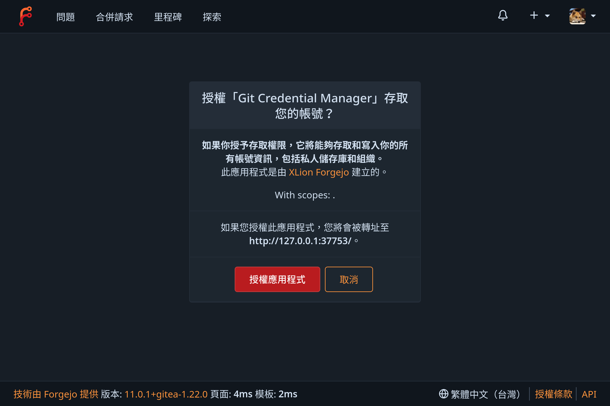

## Why

我很喜歡那種短期 Token 的想法，而不是每個要連線的設備都要去單獨創 Token，這東西在 Windows 是內建的，估計是因為是微軟維護的緣故，但 Linux 沒有內建，都得自己設定。

其實 GitHub, GitLab 我是一直都用 `gh` 跟 `glab` 當憑證提供者，但我在 Windows 上與[我的 Forgejo](https://git.xlion.tw) 互動時，跳出了瀏覽器請求授權



所以我也要在 Linux 設定一下

## 啟用 Terra repo

[Terra repo](https://terra.fyralabs.com/) 是專為 Fedora 使用者提供官方 repo 不提供的 packages

```sh
sudo dnf install --nogpgcheck --repofrompath 'terra,https://repos.fyralabs.com/terra$releasever' terra-release
```

## 安裝

```sh
sudo dnf install gcm-core
```

## 設定

```sh
git credential-manager configure
git config --global credential.credentialStore secretservice
```

`secretservice` 很多時候意味著 GNOME Keyring，就算在用 KDE 也一樣

驗證設定，去隨便一個 git repo 目錄執行

```sh
git-credential-manager diagnose    
```

```
Running diagnostics...

 [ OK ] Environment
 [ OK ] File system
 [ OK ] Networking
 [ OK ] Git
 [ OK ] Credential storage
 [ OK ] Microsoft authentication (AAD/MSA)
 [ OK ] GitHub API

Diagnostic summary: 7 passed, 0 skipped, 0 failed.
Log files:
  你現在的目錄/gcm-diagnose.log

Caution: Log files may include sensitive information - redact before sharing.
```

確認沒問題後把 `gcm-diagnose.log` 刪掉

## 使用

我是用 KDE，所以先確保之前存在 KWallet 的登入憑證先清掉，然後再嘗試 Push，應該要跳出瀏覽器登入，授權之後能成功 Push 就是成功了。 

## 然後...

我的 blog 推送到 GitHub 出問題了，它不去用 `gh` 了，解法是先去 `~/.gitconfig` 把 GitHub 有關的東西通通清光，然後再執行 `gh auth setup-git` 解決。

https://github.com/cli/cli/issues/3796#issuecomment-908241663