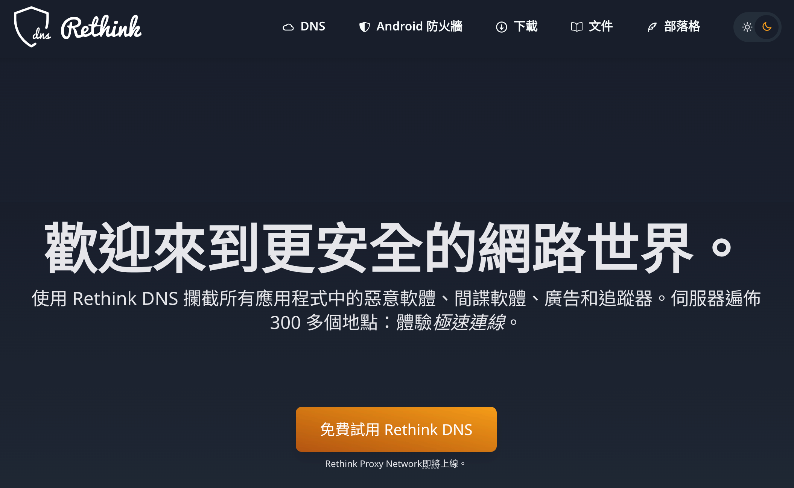

本文章將使用 HaGeZi 的封鎖列表



## 需求

本教學適用於以下系統/環境

* Android 9/10 或更新版本
* iOS 14 或更新版本
* iPadOS 全部（iOS 14 為 iPadOS 改名前發布）
* macOS 11 Big Sur 或更新版本
* 所有除 Apple 行動平台上的瀏覽器

Windows 11 不能用 Rethink DNS 套用至系統層級，可以用 [Mullvad DNS](https://mullvad.net/en/help/dns-over-https-and-dns-over-tls#win11) 然後瀏覽器再參照本文


廣告伺服器與正常內容伺服器共用的情況無法用此方法阻擋，包括但不限於 YouTube、Facebook、Instagram 以及 Reddit 等平台內的廣告

Android Firefox + 插件或電腦 + 插件可能可以擋掉 YouTube 的廣告


## Why

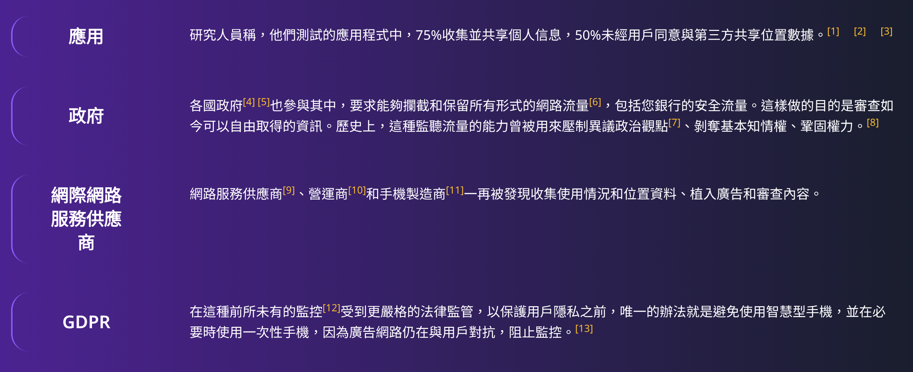


廣告公司們以及各種資料蒐集公司都會蒐集所有使用者的資料並將其用於定向廣告或是拿去「販售」，這不僅會導致上網時會被廣告內容嚴重覆蓋，還嚴重侵害使用者的隱私，所以但凡上網都需要採取手段盡力封鎖它們，而且你這麼做其實還會更省電更環保，因為這些垃圾內容不會再耗費能源來傳遞與載入！

## 原理

這是使用 DNS 的方式阻擋的，DNS 就是把網址轉成 IP 地址的伺服器

例如：

`cloudflare-dns.com` -> `104.16.249.249`

沒有它，你的設備無法知道它要如何聯絡伺服器。

那麼，擋廣告或隱私過濾的 DNS 會這麼做：

`notify.bugsnag.com` -> `0.0.0.0`

`0.0.0.0` 也等同無效的 IP，所以也會讓該伺服器無法被存取，從而達到目的。

## 設定（共通）

**此區塊為所有系統的共通步驟**，都要看。

1. 前往 https://rethinkdns.com/configure ，如為 Apple 行動平台，必須使用 Safari 開啟

2. 如果是手機或螢幕較小設備，可先點擊右上角漏斗圖示進行篩選，並選取「HaGeZi」使他「反黑」

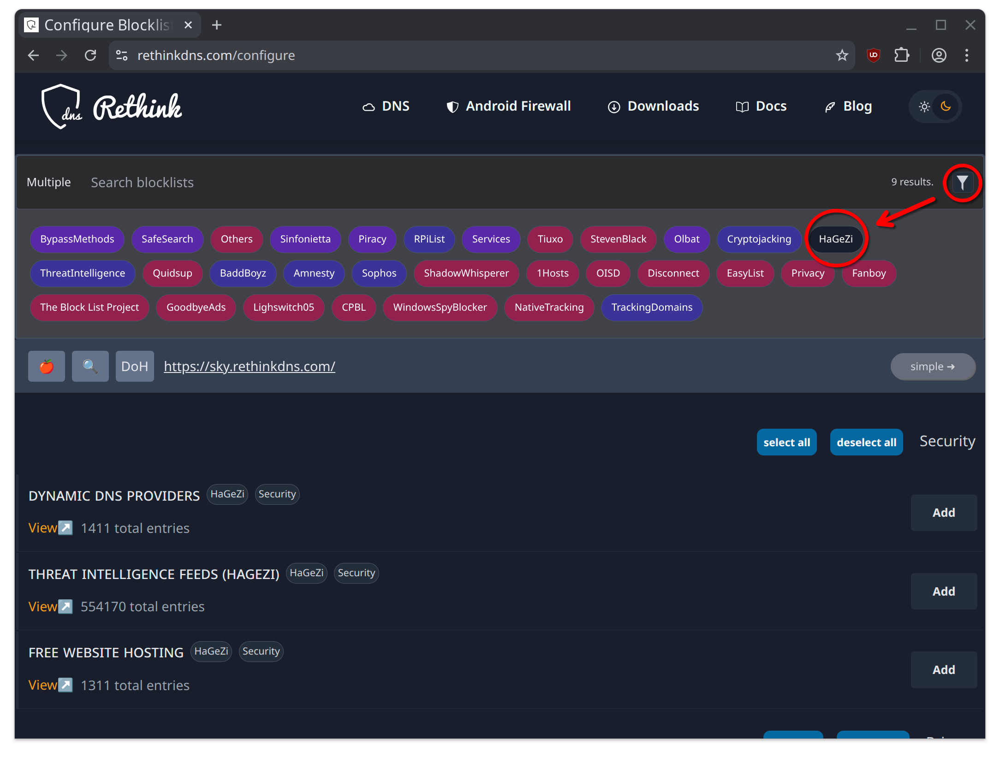

接下來可以再點擊漏斗圖示把它收起來

3. 選取 `Threat Intelligence Feeds (HaGeZi)`（安全威脅大數據）以及 `Multi Pro (HaGeZi)`（主要廣告封鎖）使它們狀態為 `Added`
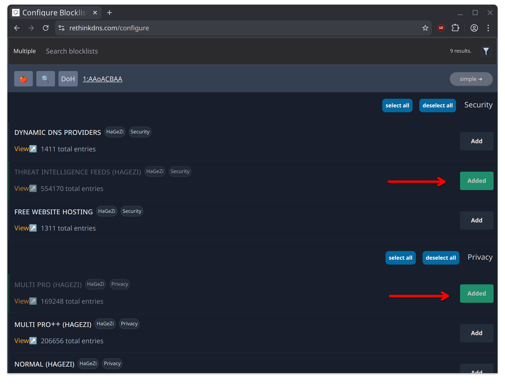

4. 接下來你可以透過「放大鏡」右邊的按鈕切換 DoH 或 DoT 兩種連接模式，然後點擊右邊字串可以複製出兩種使用連結，對於非 Apple 行動平台，你可以直接複製直接使用的連結

**DoH (DNS over HTTPS):**

```
https://sky.rethinkdns.com/1:AAoACBAA
```

**DoT (DNS over TLS):**

```
1-aafaacaqaa.max.rethinkdns.com
```

有關這兩個封鎖清單的詳細資訊，請見其 README：

https://github.com/hagezi/dns-blocklists



如果日後 HaGeZi 停止維護，你可以用同樣方式但選擇不同的封鎖清單來繼續使用。

## 設定（系統層級）

以下將會套用至系統層級，意味著瀏覽器之外也可以運作，包含行動網路以及 WiFi。

### Android

Android 只支援 DoT，你可以先複製上方的 DoT 連結

進入系統設定中的「更多連線」，或者是「網路與網際網路」內，尋找「私人 DNS」或「專用 DNS」等相關字眼，大部分時候會與「飛航模式」與「無線基地台/熱點」同一個頁面，如果還是找不到，可以在設定內用搜尋的

點擊它點開後，請選擇「主機名稱」或相關字眼的選項，選取後，會跑出可輸入的欄位，將 DoT 格式的地址填入後儲存

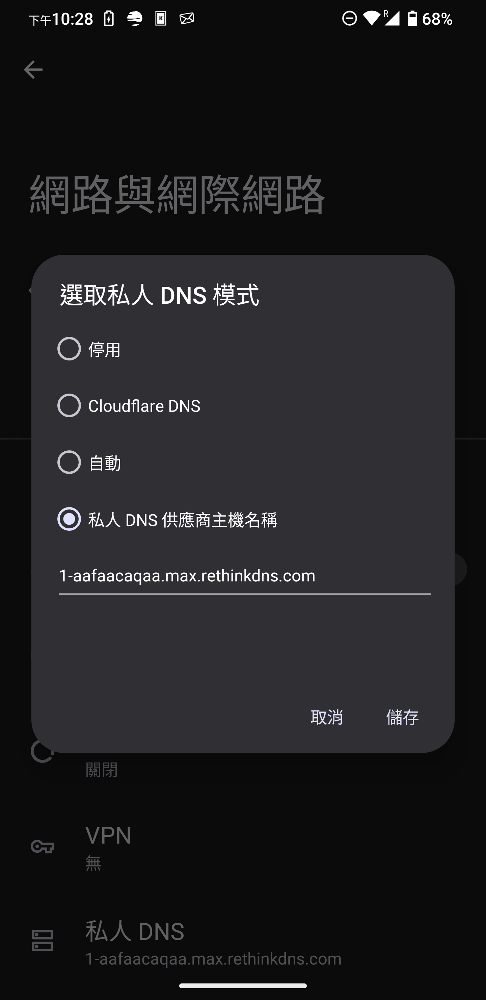

### iOS/iPadOS/macOS

Apple 平台大同小異，這裡以 iOS 截圖為例

**請確保先看完並做完共通設定。**

1. 點擊蘋果圖案，下載描述檔

蘋果同時支援 DoH 以及 DoT，在兩者都支援的情況下更建議使用 DoH，因為它更不容易被偵測與封鎖

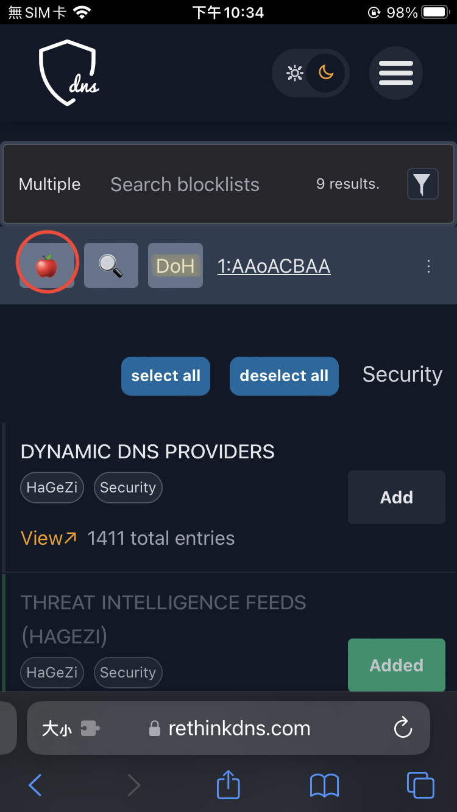

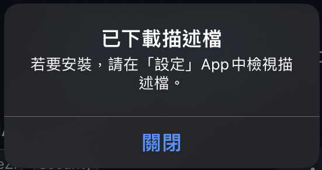

2. 進入系統設定，你會看到「已下載描述檔」提示，點進去

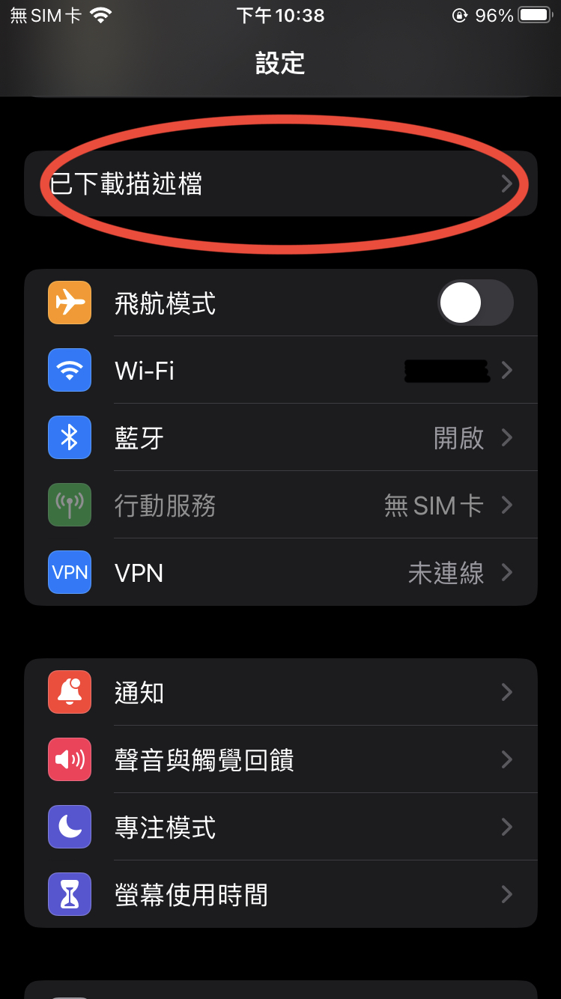

3. 安裝描述檔，下一步數次，系統會提醒你 DNS 會監控你的流量，正常的，繼續

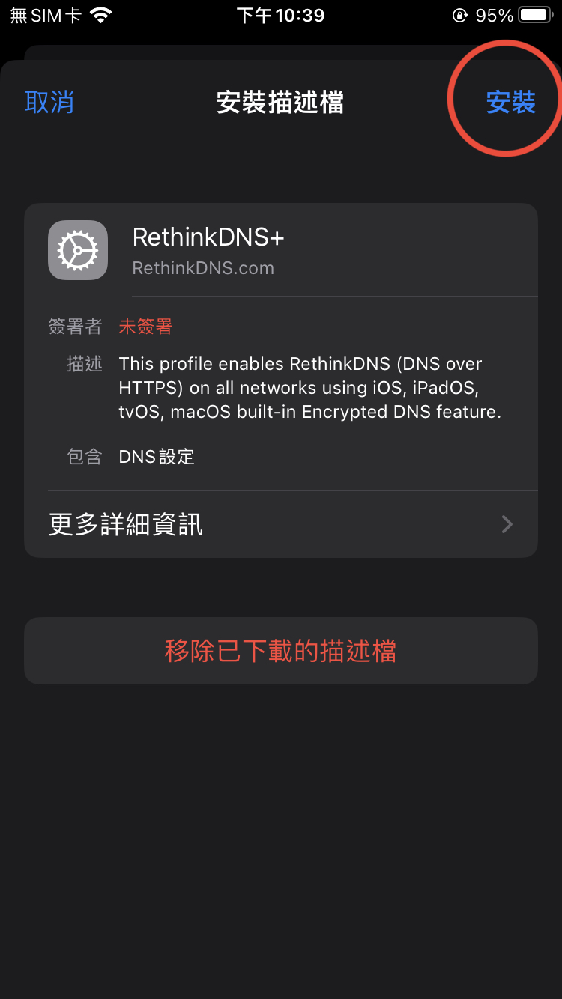

如果想要，你可以查看更多詳細資訊

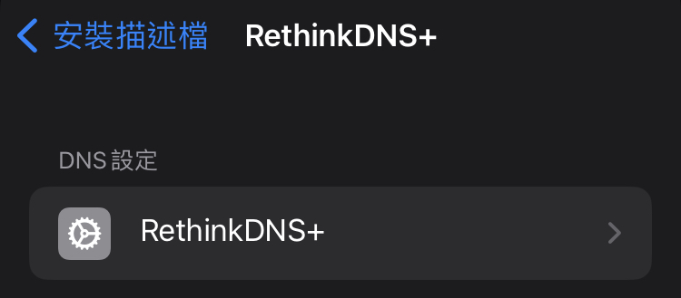
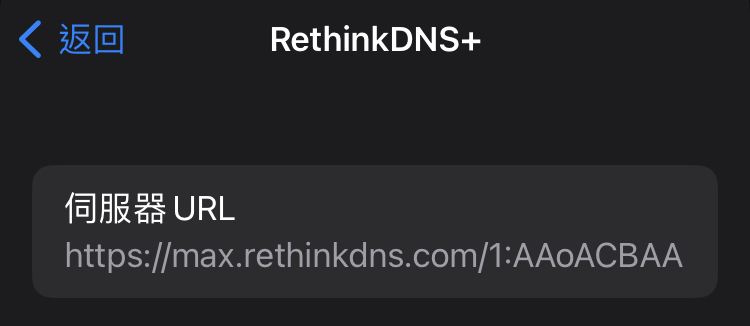

4. 安裝好後你會看到 DNS 欄位會是 Rethink DNS

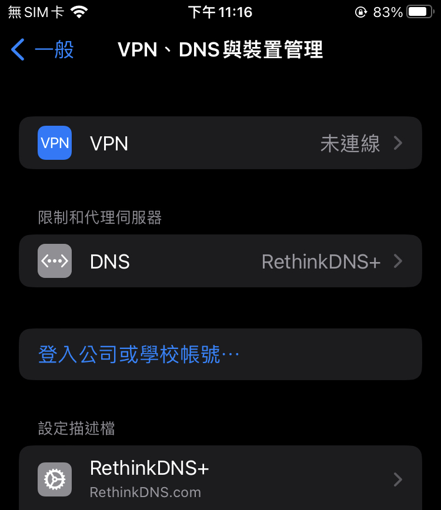

如果點進去，可以看到已經安裝的 DNS 描述檔列表，如果需要臨時關閉，可以選取「自動」。

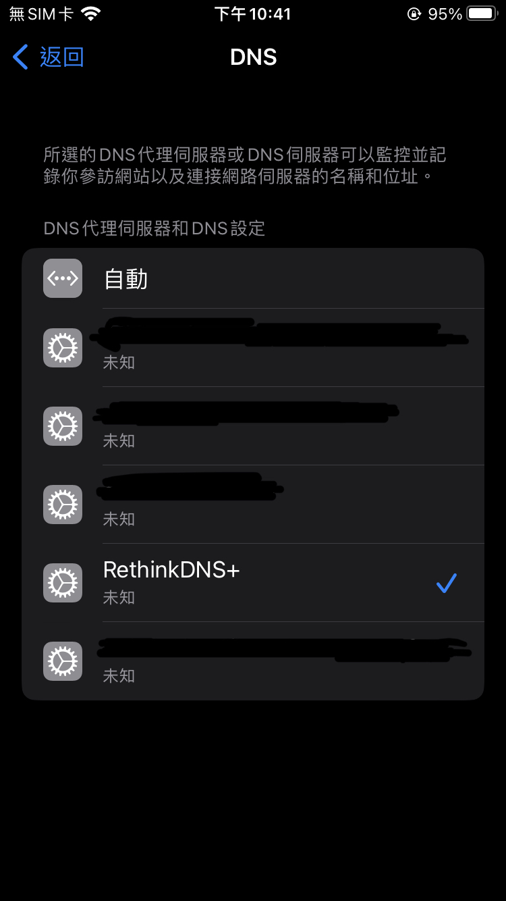

5. Apple iCloud Private Relay 私密轉送「有可能」（不一定）會讓你的 DNS 描述檔無效化，如果發現沒作用可嘗試關閉 

**我離開了這個頁面，這個地方在哪？**

設定 -> 一般 -> VPN、DNS 與裝置管理

## 設定（瀏覽器）

瀏覽器層級，只會套用至瀏覽器，就算系統層級設定了這裡也建議設定，因為瀏覽器可能會內定一個伺服器導致繞過。

本區塊不適用 Apple 行動平台（iOS/iPadOS）的**所有**瀏覽器，因為 Apple 不允許這麼做，以及 macOS 上的 Safari，macOS 其他瀏覽器可以設定。

### Chrome Android

進入設定 -> 隱私權與安全性 -> 安全性 -> 使用安全 DNS

選擇其他供應商後填入 DoH 地址

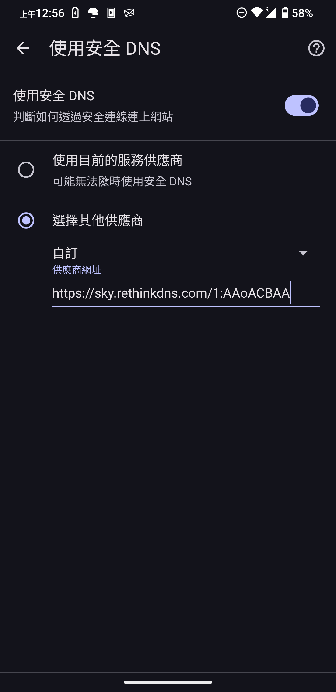

### Firefox Android

1. 進入設定 -> DNS over HTTPS

2. 選取最大保護，提供者自訂，填入 DoH 連結

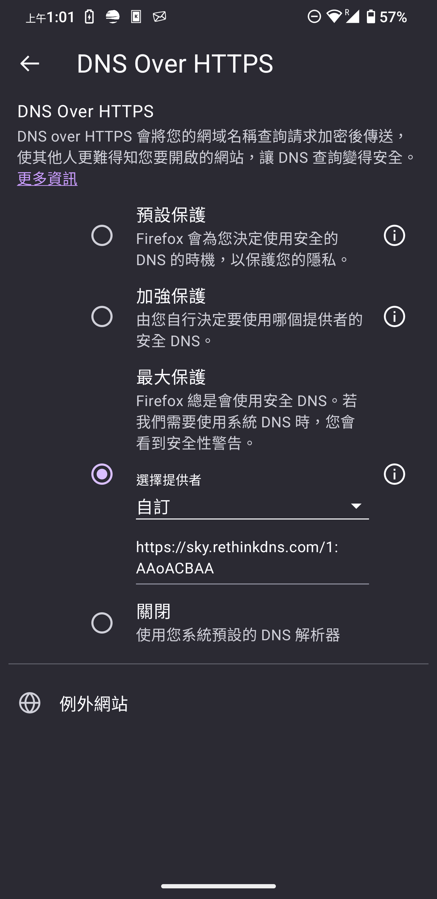

3. Android Firefox 還可以安裝插件，建議安裝，它會讓廣告封鎖以及隱私保護更全面

https://addons.mozilla.org/zh-TW/android/addon/ublock-origin/

### Firefox based

1. 進入設定 -> 隱私權與安全性 -> 到最底部來到 -> DNS over HTTPS

2. 選取最大保護，提供者自訂，填入 DoH 連結

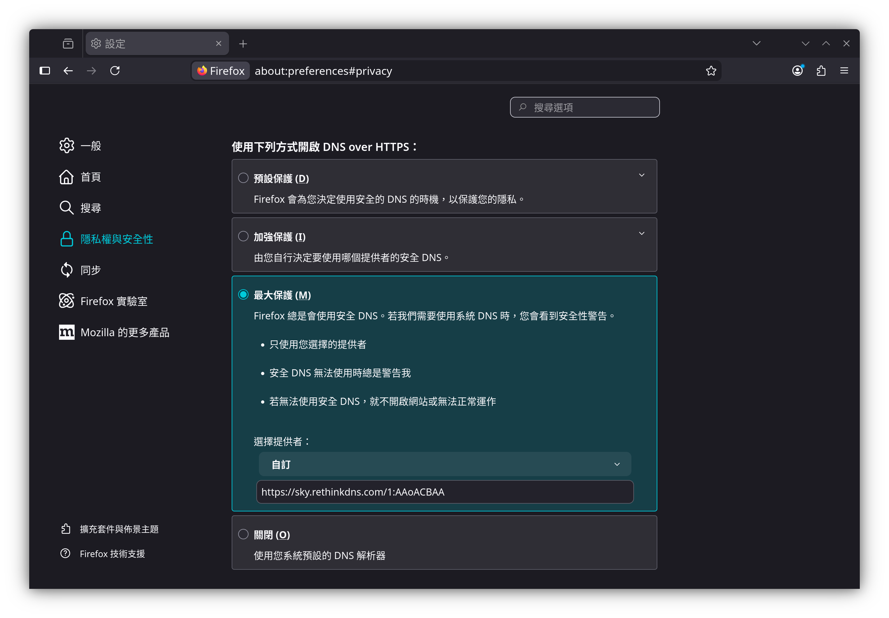

3. 我還強烈建議你安裝 uBlock Origin 插件，它會讓廣告封鎖以及隱私保護更全面：

https://addons.mozilla.org/zh-TW/firefox/addon/ublock-origin/

### Chromium based

首先，我鼓勵你改為使用 Firefox 瀏覽器 + uBlock Origin 插件（或基於 Firefox 的其他瀏覽器），因為 Google 強硬推行了權限更限縮的插件標準（Manifest V3），導致擋廣告插件只能以受限的方式運作。

**不建議**使用 Microsoft Edge 以及 Brave 瀏覽器，前者是資料收集與隱私侵害的另一個深淵，後者宣稱隱私與擋廣告，但它們公司的收入來源之一就是廣告，並且也有轉售資料的紀錄，極其諷刺，其創辦人 Brandon Eich 還有在先前擔任 Mozilla 執行長時因恐同事件後離職。雖然 Google 在資料蒐集上不遑多讓，但它是兩害相權取其輕的結果。

此區塊包含 Google Chrome、Microsoft Edge 以及 Brave 之類的瀏覽器。

1. 進入設定 -> 隱私權與安全性 -> 安全性 -> 使用安全 DNS 打開

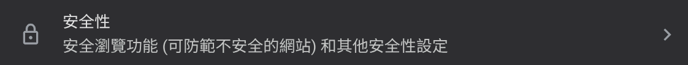

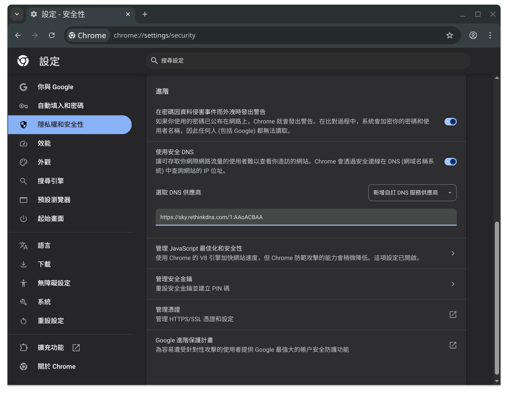

2. 選取 DNS 供應商選取「新增自訂 DNS 服務供應商」並填入 DoH 連結

3. 我還強烈建議你安裝 uBlock Origin Lite 插件，它會讓廣告封鎖以及隱私保護更全面，至於為何是 Lite 就是因為前述的原因

https://chromewebstore.google.com/detail/ddkjiahejlhfcafbddmgiahcphecmpfh

# Ref

https://docs.quad9.net/

https://adguard.com/en/blog/our-comment-on-chrome-ad-blocking.html

https://arstechnica.com/gadgets/2024/08/chromes-manifest-v3-and-its-changes-for-ad-blocking-are-coming-real-soon/

https://www.reddit.com/r/browsers/comments/1j1pq7b/list_of_brave_browser_controversies/

https://www.reddit.com/r/lgbt/comments/1e1ej3i/reminder_dont_use_the_brave_browser/

https://www.bbc.com/news/technology-26868536
